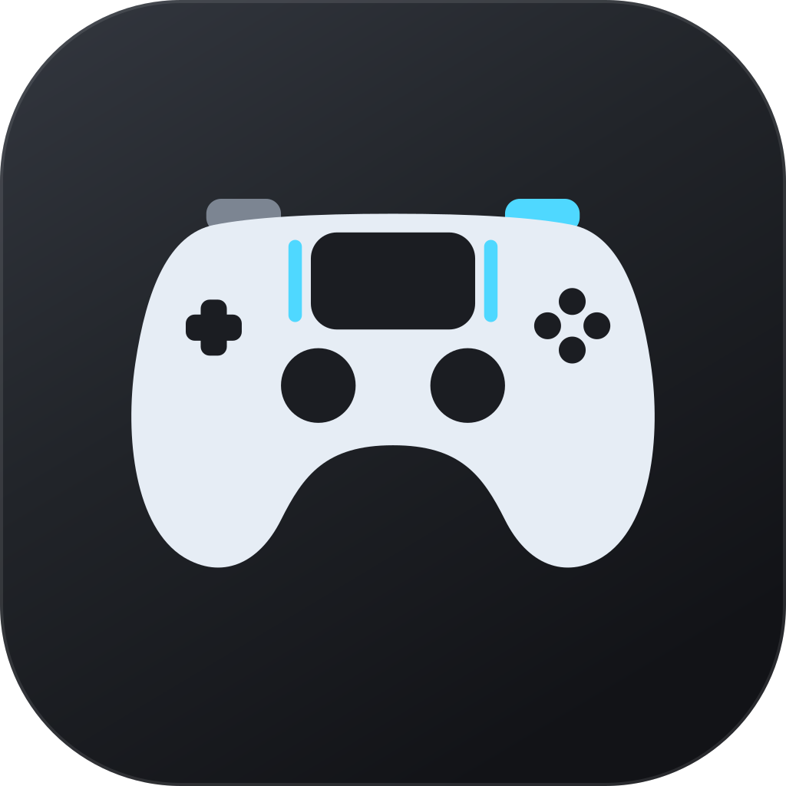

# Sticky Fingers



**A native, open-source DualSense control studio for macOS.**

[](https://github.com/DegenerateUSER/DualsenseT/actions/workflows/ci.yml)
[](LICENSE)
[](#system-requirements--setup)
[](TEST_READY.md)

Sticky Fingers unlocks adaptive triggers, controller lighting, rumble, motion diagnostics,
profiles, and USB audio haptics for PlayStation 5 DualSense controllers on Apple silicon
Macs. It works over USB and Bluetooth, stays active while you play, and keeps advanced
diagnostics out of the way until you need them.

> Sticky Fingers is an independent community project. It is not affiliated with, endorsed
> by, or sponsored by Sony Interactive Entertainment. “PlayStation” and “DualSense” are
> trademarks of their respective owners.

## Highlights

- **Adaptive triggers over USB and Bluetooth** — 11 editable modes for L2 and R2.
- **USB audio haptics** — turn game, video, or music audio into independent grip feedback.
- **Controller audio** — speaker/headset routing, microphone source, gain, and mute.
- **Lighting and rumble** — lightbar color/pulse, player LEDs, mic LED, independent motors.
- **Live diagnostics** — responsive controller map, touch points, gyro/accelerometer fusion.
- **Automation** — built-in/custom presets, per-app switching, menu-bar controls.
- **Game integration** — DualSenseX-compatible UDP server for mods and compatibility layers.
- **Privacy-first** — controller and audio processing stay on the Mac.

## Quick Start

1. See [Installation](docs/INSTALLATION.md) for a release build or source build.
2. Connect a DualSense through USB or Bluetooth.
3. Configure triggers, lighting, haptics, or a preset.
4. For USB audio haptics, grant Screen & System Audio Recording when prompted.
5. Switch to your game; Sticky Fingers continues running in the background.

## Documentation

- [Installation and permissions](docs/INSTALLATION.md)
- [User guide](#tab-by-tab-dashboard-guide)
- [Troubleshooting](docs/TROUBLESHOOTING.md)
- [Architecture](docs/ARCHITECTURE.md)
- [USB audio and haptics internals](USB_AUDIO_HAPTICS.md)
- [Privacy](PRIVACY.md)
- [Launch and messaging playbook](docs/MARKETING.md)
- [Competitive positioning](docs/COMPETITIVE_POSITIONING.md)
- [Launch readiness checklist](LAUNCH_CHECKLIST.md)
- [Contributing](CONTRIBUTING.md)
- [Security](SECURITY.md)
- [Release process](RELEASING.md)
- [Changelog](CHANGELOG.md)

---

## Table of Contents
1. [System Requirements & Setup](#system-requirements--setup)
2. [Dual-Mode Architecture](#dual-mode-architecture)
3. [Tab-by-Tab Dashboard Guide](#tab-by-tab-dashboard-guide)
   * [Left Trigger (L2) & Right Trigger (R2)](#1-left-trigger-l2--right-trigger-r2)
   * [Lightbar](#2-lightbar)
   * [Haptics (Rumble, Mic LED, Player LEDs)](#3-haptics)
   * [Controller Audio & Audio Haptics](#4-controller-audio--audio-haptics-usb-only)
   * [Live Map (Visualizer)](#5-live-map-visualizer)
   * [Sensors (Gyroscope & Accelerometer)](#6-sensors-gyroscope--accelerometer)
   * [UDP Server](#7-udp-server)
   * [Presets](#8-presets)
   * [Settings (Touchpad Gestures & Profiles)](#9-settings)
4. [Advanced Engineering Features](#advanced-engineering-features)
   * [Adaptive IMU Complementary Filter](#adaptive-imu-complementary-filter)
   * [Runtime CPU Optimization](#runtime-cpu-optimization)
   * [Raw HID Background Override](#raw-hid-background-override)
5. [Compilation & Unit Testing](#compilation--unit-testing)

---

## System Requirements & Setup

* **Operating System:** Built for macOS 14.0 (Sonoma) or newer on Apple silicon.
* **Supported Hardware:** DualSense (CFI-ZCT1W) is hardware-verified. DualSense Edge
  (CFI-ZCP1) detection is implemented, but its complete launch test matrix is still pending.
* **Connection Type:**
  * **Bluetooth (Wireless):** Hardware-verified for adaptive triggers, LED lightbar, rumble, mic/player LEDs, touchpad, gyro/accelerometer, battery, and live input through the app's exclusive raw-HID path.
  * **USB (Wired):** Direct wired transport and the required connection for controller audio.

---

## Dual-Mode Architecture

### 1. Menu Bar Helper
On launch, Sticky Fingers also runs as a status item in the macOS Menu Bar.
* **Live Status:** Displays connection type and battery percentage (e.g. `[BT] 85%` or `[USB] 100%`).
* **Quick Action Presets:** Click the menu icon to switch between default presets (e.g. Bow & Arrow, Heavy Rifle, Racing Brake, Machine Gun, Semi-Auto Pistol, and more) instantly without opening the dashboard.
* **Window Controls:** Open the main configuration dashboard or quit the app cleanly.

### 2. Main Dashboard Window
A clean, premium, semi-transparent SwiftUI dashboard with a normal Dock icon. Closing the
window hides it without stopping controller profiles, audio haptics, or the UDP server.
Clicking the Dock icon reopens it. Quit through **⌘Q**, the application menu, the Dock
context menu, or the menu-bar helper.

---

## Tab-by-Tab Dashboard Guide

### 1. Left Trigger (L2) & Right Trigger (R2)
These tabs let you configure Sony's physical **Adaptive Triggers** to simulate different mechanical behaviors. Sticky Fingers exposes **11 editable native trigger modes** and maps 19 DualSenseX UDP trigger types to their closest supported effect.

#### Basic Modes:
* **Off (Default):** Normal trigger pull. No added resistance or haptic feedback.
* **Feedback:** Continuous resistance from a configurable start position onward.
  * *Start Position, Strength*
* **Weapon:** Resistance zone between start and end — simulates a firearm trigger pull.
  * *Start Position, End Position, Strength*
* **Vibration:** Haptic vibration buzzing against your finger.
  * *Start Position, Amplitude, Frequency*

#### Advanced Modes:
* **Section Resistance:** Resistance only within the start-end zone — no effect outside that range.
  * *Start Position, End Position, Strength*
* **Semi-Automatic:** Resistance between start and end positions, snaps back when released past end. Simulates a semi-auto firearm.
  * *Start Position, End Position, Strength*
* **Automatic:** Continuous full-pull resistance with a repeating cycle effect.
  * *Start Position, Strength, Effect Frequency*

#### Expert Modes:
* **Slope Feedback:** Gradually increasing resistance from a start strength to an end strength across the trigger travel. Perfect for realistic brake simulation.
  * *Start Position, End Position, Start Strength, End Strength*
* **Multi-Position Feedback:** Alternating strong/weak resistance zones for a bumpy, textured resistance feel.
  * *Start Position, Strength*
* **Multi-Position Vibration:** Alternating vibration intensities for a textured vibration pattern.
  * *Start Position, Amplitude, Frequency*
* **Full Press:** Maximum resistance across the entire trigger travel. No parameters needed.

#### Visual Preview & Test Gauge:
* **Live Spring-Loaded Preview Bar:** Displays a simulated haptic bar showing trigger state, mode-specific active zones, and vibration effects with per-mode color coding.
* **Physical Pull Gauge:** A blue bar showing the real-time physical position of your finger on the controller trigger.

---

### 2. Lightbar
Allows customizing the LED lightbar wrapping around the touchpad.
* **Color Picker:** Select any color from a native picker.
* **Pulse Mode:** Enables a breathing/pulsing animation effect.
* **Presets:** Quick buttons to select signature PlayStation Blue, Neon Cyan, Neon Purple, Neon Orange, or Red.

---

### 3. Haptics
A dedicated tab for **rumble motors**, **microphone LED**, and **player indicator LEDs** — all controlled via raw HID reports.

#### Rumble Motor Test:
* **Left & Right Motor Sliders:** Independently control the intensity (0-100%) of each rumble motor.
* **Quick Actions:**
  * **Test Pulse:** Smooth ramp-up/ramp-down intensity pattern.
  * **Heartbeat:** Two quick pulses followed by a pause — mimics a heartbeat.
  * **Max Power:** Sets both motors to 100%.
  * **Stop All:** Immediately silences both motors.

#### Microphone LED:
* **Off / On / Pulse:** Controls the orange mute indicator LED next to the microphone. Useful for visual status indicators.

#### Player Indicator LEDs:
* **5-LED Toggle Grid:** Individually toggle each of the 5 indicator LEDs below the touchpad.
* **Player Presets (P1-P5):** Standard PlayStation player number patterns.
* **All Off:** Clears all indicator LEDs.

---

### 4. Controller Audio & Audio Haptics (USB Only)
The Audio tab uses the DualSense USB Audio Class interface. Bluetooth does not expose audio.

* **Hardware Discovery:** Detects the separate Sony four-channel output and two-channel
  microphone endpoints at 48 kHz.
* **Automatic Quadraphonic Setup:** Configures Front L/R plus Haptic L/R without changing
  the Mac's default output device.
* **Controller Audio Controls:** Headset/controller-speaker routing, microphone source,
  independent headset/speaker/microphone levels, and hardware microphone mute.
* **Advanced Diagnostics:** Optional Front L/R audible tones, independent Haptic L/R
  actuator tests, channel layout, device identity, and stream counters.
* **System Audio Capture:** Uses the standard macOS Screen & System Audio Recording
  permission and shows one clean live haptic-response meter.
* **Audio Haptics:** Extracts bass/transients from game, music, or video audio and streams
  stereo feedback to the two grip actuators while normal Mac audio continues unchanged.
* **Portable PCM Layouts:** Reads CoreMedia AudioBufferLists correctly whether ScreenCaptureKit
  supplies planar, interleaved, or mono Float32 samples.

Hardware verified: Quadraphonic setup, both haptic channels, controller speaker, controller
microphone, capture meter, video-driven haptics, and simultaneous adaptive-trigger effects on
a base M1 MacBook Air running macOS 27 Golden Gate. Wired headset and long-run
stability/reconnect testing remain pending. See `USB_AUDIO_HAPTICS.md`.

---

### 5. Live Map (Visualizer)
Provides a real-time vector schematic of the controller to diagnose inputs.
* **Button Highlights:** Pressing buttons (Cross, Circle, Square, Triangle, L1, R1, Options, Create, PS) highlights the corresponding key in blue.
* **Joystick Tracking:** Left/right analog caps move proportionally on the controller schematic, with L3/R3 press feedback.
* **Touchpad Mapping:** Displays one or two active fingers on the controller touchpad with animated ripple markers. Precise numeric coordinates are available in the Sensors tab.

---

### 6. Sensors (Gyroscope & Accelerometer)
Provides 3D spatial diagnostics of the controller's motion.
* **3D Glowing Card:** A rendered 3D rectangle that rotates in real-time to match the pitch, roll, and yaw of your physical controller.
* **Attitude Quaternion:** Displays the mathematically computed quaternion coordinates (`w`, `x`, `y`, `z`) in real-time.
* **Recenter Sensors:** Click this button (or wait for the 0.3-second auto-align) to set the controller's current orientation as the "flat" reference point.

---

### 7. UDP Server
Emulates the **DualSenseX UDP Server protocol** on port `6969`.
* **Purpose:** Allows games running inside Wine, CrossOver, Game Porting Toolkit, or native game mods (e.g. Cyberpunk 2077, Spider-Man) to send JSON instructions directly to your controller triggers and LEDs.
* **Extended Protocol:** Maps all 19 DSX trigger types (Normal, Custom, GameCube, Resistance, Bow, Galloping, SemiAutomaticGun, AutomaticGun, Machine, Choppy, VerySoft through Hardest, Rigid, VibrateTriggerPulse, VibrateTrigger) to the closest native Sticky Fingers trigger mode for maximum fidelity.
* **Configuration:** Toggle active server status and configure the server to launch automatically on app startup.

---

### 8. Presets
Manage custom profiles.
* **12 Default Presets:** *Bow & Arrow*, *Heavy Rifle*, *Racing Brake*, *Soft Click*, *Galloping*, *Machine Gun*, *Heavy Spring*, *Semi-Auto Pistol*, *Automatic Rifle*, *Bumpy Road*, *Slope Brake*, and *Off*.
* **Save Current Preset:** Save your active L2/R2 trigger settings, LED color, and haptic pulsing configurations into a named preset.
* **Custom Presets:** List, apply, or delete your custom saved presets. Presets are saved locally as standard JSON files with backward-compatible loading.

---

### 9. Settings
Advanced remapping and background automation.

#### Per-App Profiles:
* Assign a trigger preset to a specific application or game (e.g., Steam games, Crossover, Céleste).
* The app runs a lightweight background observer that automatically swaps controller configurations when the assigned game window is focused.

#### Touchpad Gesture Remapping:
* Map swipe directions (Up, Down, Left, Right) to keypress simulations.
* Supports mapping gestures to Spacebar, Left Arrow, Right Arrow, Up Arrow, and Down Arrow at the virtual HID level.

---

## Advanced Engineering Features

### Adaptive IMU Complementary Filter
The macOS `GameController` framework does not natively populate the `attitude` quaternion (returns static `w:1, x:0, y:0, z:0`) for the DualSense controller. To solve this, Sticky Fingers implements an **Adaptive Complementary Filter** that fuses raw sensor data in real-time:
1. **Gyroscope Integration:** Integrates the rotation rates around the X (pitch), Y (yaw), and Z (roll) axes.
2. **Accelerometer Drift Correction:** Uses the gravity vector from the accelerometer to correct pitch and roll drift.
3. **Adaptive Gain Coupling:** 
   * When in fast motion, the accelerometer correction is bypassed to avoid centripetal force corruption.
   * When stationary, the filter gain increases ($k_{acc} = 0.1$) to quickly align the controller flat to gravity.
4. **Resting Auto-Decay:** When resting still, the integrated yaw (which has no absolute compass reference) decays slowly back to $0.0$, eliminating yaw drift.

### Runtime CPU Optimization
DualSense input reports and motion samples can arrive hundreds of times per second, far
faster than a display can render. To avoid wasting CPU while preserving controller fidelity:
* Bluetooth input is drained continuously but decoded and delivered to the UI at no more than 60 Hz.
* Button state is published as one coalesced snapshot; unchanged battery, button, trigger,
  stick, and touch values are not republished.
* One-count analog stick jitter is filtered from visual updates.
* Motion fusion still consumes high-rate sensor samples for accuracy, while SwiftUI attitude
  rendering is capped at 60 Hz.
* Motion and live UI publication stop when the dashboard is closed, minimized, or fully
  occluded by another window.
* Lightbar breathing uses 10 HID updates per second instead of 20.

### Raw HID Background Override
The macOS `GameController` framework ceases sending output reports to controllers when the host application loses window focus. To keep adaptive triggers active when you click away to play a game, Sticky Fingers implements a multi-layered persistence system:

1. **Dual Focus Detection:** Monitors both `NSApplication.didResignActiveNotification` and `NSWorkspace.didActivateApplicationNotification` to reliably detect focus loss.
2. **Exponential Backoff Burst:** On focus loss, immediately fires 8 HID reports at 0/30/60/100/200/500/1000/2000ms intervals to win the race against macOS and GameController framework resets.
3. **Adaptive Background Timer:** Starts at 50ms polling for the first 3 seconds (critical window), then settles to 500ms for sustained background operation.
4. **Stale Device Recovery:** If an HID write fails, automatically clears the cached device handle, resets the Bluetooth sequence number, and retries with a freshly discovered device.
5. **Reconnection Resilience:** On controller reconnect, invalidates the cached HID device to force fresh discovery, preventing stale handle issues.

---

## Compilation & Unit Testing

The repository contains a simple, zero-dependency packaging structure and build pipeline.

### Build and Package:
Run the build script to compile `main.swift` and generate `Sticky Fingers.app`:
```bash
./build.sh
```

### Run Unit Tests:
Run the build script with the `test` argument to compile and execute the custom unit test harness (`Tests/Tests.swift`):
```bash
./build.sh test
```
The 75-test suite validates preset serialization, parameter parsing, touchpad remapping,
motion math, HID report construction, background transitions, PCM decoding, audio buffering,
UDP loopback boundaries, and end-to-end scenarios.

## License

Sticky Fingers is free software licensed under the
[GNU General Public License version 3 only](LICENSE). Vendored components and their terms are
listed in [Third-Party Notices](THIRD_PARTY_NOTICES.md).

Copyright © 2026 DegenerateUSER and contributors.
